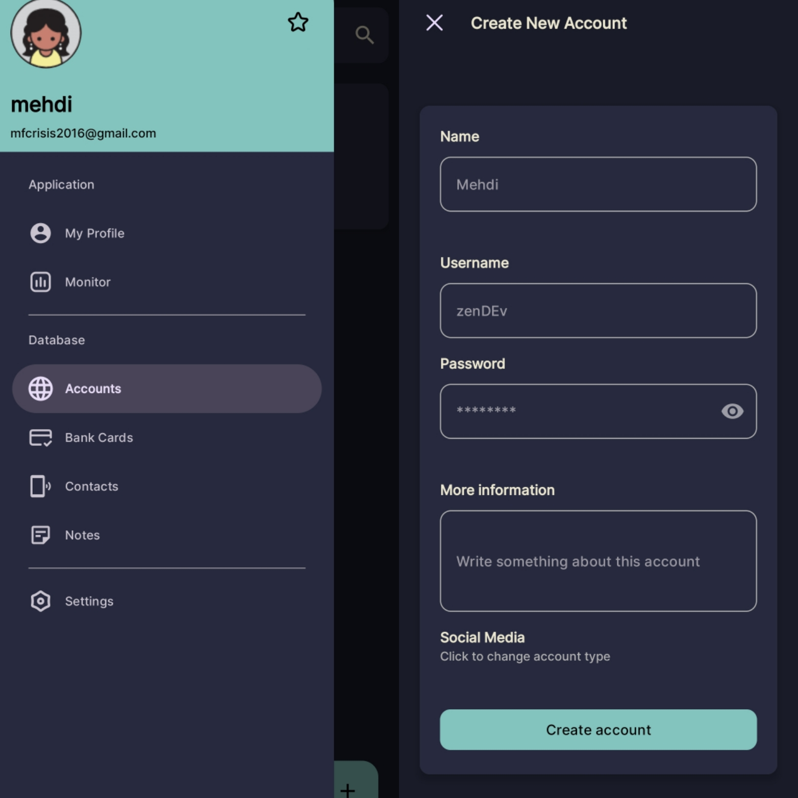
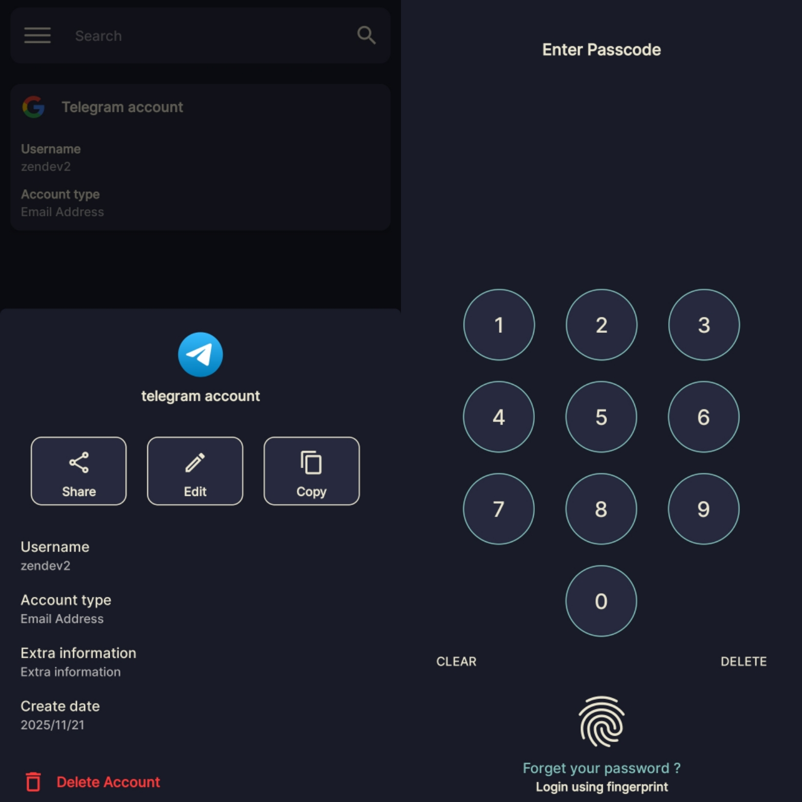
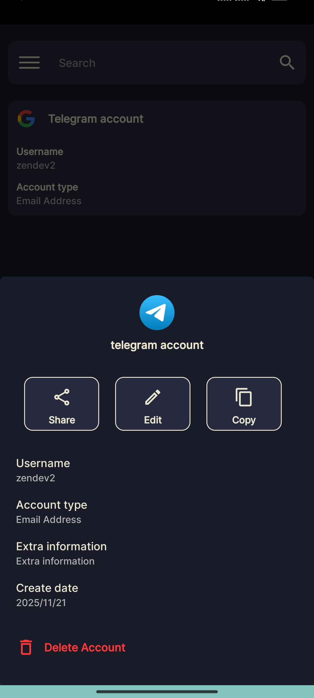

# FortKnox

This new application is built upon the foundation of the original keepergen code base, but it has comprehensively addressed and resolved security vulnerabilities and user interface inconsistencies found in the predecessor. The software functions as a personal data vault, designed to securely store all your personal and sensitive information.


## ⚡️ Features

The software provides structured categories for data management, along with essential tools for interaction:

Structured Data Categories

- Internet Accounts: (Websites, social media networks)

- Bank Cards: (Credit, debit, etc.)

- Contacts

- Notes (Secure, encrypted memos)

Functionality and Management

- CRUD Operations: Ability to perform standard Create, Read, Update, and Delete operations on every stored item.

- Profile Management & Sync: Includes profile administration and the ability to securely sync data from the device to a private database, enabling seamless access across any device where the application is installed.

Data Sharing: Capability to securely share information with other applications (if authorized by the user).

High-Speed Search: Built-in search functionality allowing users to quickly and efficiently locate any piece of stored information.

## ⚙️ Installation

Create new Android Studio project and copy app folder content into the project files.
For security reasons i removed RetrofitClient.kt file.
I can't allow anyone to access the server.

For local development and testing the following is the configuration for the Retrofit client.

Note: The IP address 10.0.2.2 is the special address that the Android Emulator uses to route traffic to the host computer's localhost interface.

```kotlin
package org.zen.fortknox.api.base

import okhttp3.OkHttpClient
import org.zen.fortknox.api.service.EmailService
import org.zen.fortknox.api.service.UserService
import retrofit2.Retrofit
import java.util.concurrent.TimeUnit

import retrofit2.converter.gson.GsonConverterFactory

object RetrofitClient {
    private const val BASE_URL = "http://10.0.2.2:5000/"

    private val retrofit: Retrofit by lazy {
        val client = OkHttpClient.Builder()
            .connectTimeout(30, TimeUnit.SECONDS)
            .readTimeout(30, TimeUnit.SECONDS)
            .writeTimeout(30, TimeUnit.SECONDS)
            .build()

        Retrofit.Builder()
            .baseUrl(BASE_URL)
            .addConverterFactory(GsonConverterFactory.create())
            .client(client)
            .build()
    }

    val userService: UserService by lazy {
        retrofit.create(UserService::class.java)
    }

    val emailService: EmailService by lazy {
        retrofit.create(EmailService::class.java)
    }
}
```
    
## ❓ FAQ

#### How to run project?

open Android Studio and select files.
i removed some files to make repository lighter.

those files were project essential files, so this is not usable.
what you can do is to copy all files from app folder into your project and build to run it.

#### Is APK file secure?

no the apk file was built in debug mode.
if you want secure and usable you have to generate signed apk in your project.


## 🛠 Skills

Programming

- Develop android apps
- Building REST API
- Manage sqlite, mysql database
- Programming laguages (Python - Kotlin - Bash)

IT Skills

- Working with Linux (Debian, Arch) - LPIC
- Learning Network foundations (Network+)

i am trying to work in DevOps


## ✍️ Authors

- [@Mehdi Lavasani](https://github.com/mehdiprgm)


## 🖼️ Screenshots








## 😈 Tech Stack

**Client:** Kotlin, Xml, ORM

**Server:** Python, Flask, SQL

